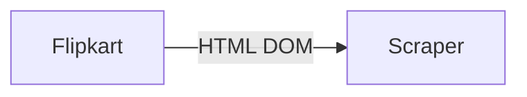

### Flipkart Review Scraper

This is a basic html scraper that pulls in the reviews from a Flipkart product review page.

Technology used:
- `BeautifulSoup` for Scraping data from the provided link.
- `Streamlit`, handles the front end. Shows the scraped data in tabular view, and provides an option to download it in a csv file.
    - The application is deployed in Streamlit's own deployment service which also handles CI/CD.

_Next upgrade will be use Selenium to extract more reviews._

